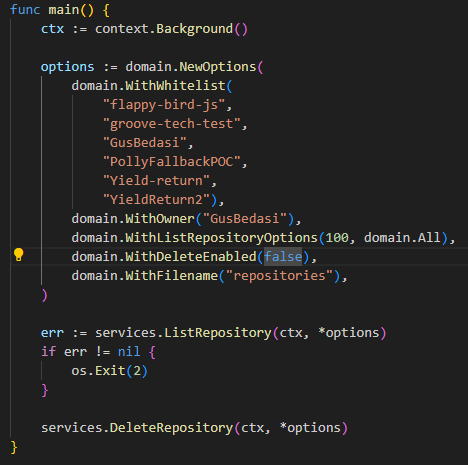
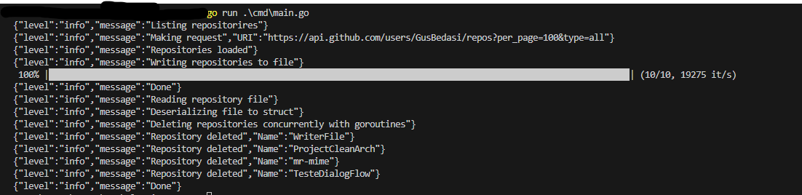

# Cleaning repositories

I built this project to clean up all my repositories which that i no longer find useful, because they're from the beggining of my carrer, so there were a lot of very basic examples, i see value in them, but i no longer needed them, so i decided to delete.

The problem was that there were more than 100 projects, so there was no chance to doing it one by one, and BOOOOOOOM i made this simple project in *GO* to list all my repositories, select the ones i want to delete and delete them all.


## Usage

After changing the options to your taste you can simply run go run ./cmd/main.go and the cleaning is gonna happen :D






## Overview
The usability is not so friendly because i did it to my personal use, but it is no that hard to use yourself.

On the main file `main.go` there is a struct made to configure what is gonna happen:

```go
func main() {
	ctx := context.Background()

	options := domain.NewOptions(
		domain.WithWhitelist("1", "2", "3"),
		domain.WithOwner("OwnerName"),
		domain.WithListRepositoryOptions(100, domain.All),
		domain.WithDeleteEnabled(false),
		domain.WithFilename("repositories"),
	)

	err := services.ListRepository(ctx, *options)
	if err != nil {
		os.Exit(2)
	}

	services.DeleteRepository(ctx, *options)
}

```

So basically there 5 things to reason about when configurin it.

#### WithWhitelist
These are the repositories you don't want to delete, repositories listed of there are gonna be safe and sound

#### WithOwner
Defines the owner of the repositories so we can do or data pulling from it

Example of owner: GusBedasi
```
https://github.com/GusBedasi/cleaining-repos
```

#### WithListRepositoryOptions
There are two parameters in this one `Quantity` and `Type` of repositories is we gonna list.

##### Quantity
Is the number of projects are gonna be listed. The maximum is 100
##### Type
There is two options of Type
* All
* Private

#### WithDeleteEnabled
These is flag made to do not delete the repositories right away, because sometimes you don't if theres is a repository that you want to keep it, so with this flag `false` we just gonna list the repositories on a file wihtout deleting them so you can reason about and add some repositories to the WhiteFlag slice.

#### WithFilname
This is gonna define the name of the `txt` file where the listed repositories will gonna be written to.

#### GITHUB API KEY
Last but no least, you got have a access token of your github account to have access to do all of those listing and deleting, your token must have permission to see all repositories and administration role to deleting them, the project automatically look for a environment variable name `"github_api_jey"`, without you gonna have a 401 i guess.

You can read more about authenticating on github api [*here*](https://docs.github.com/en/rest/overview/authenticating-to-the-rest-api?apiVersion=2022-11-28).